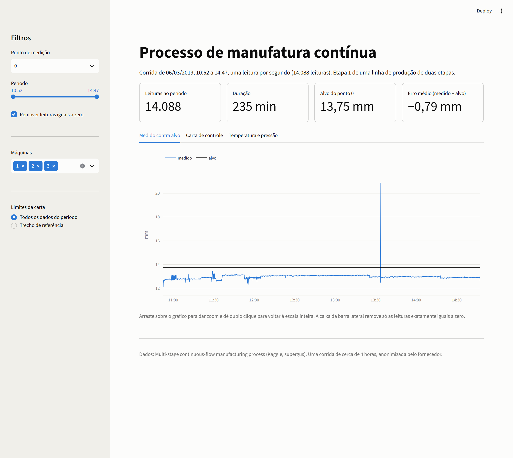
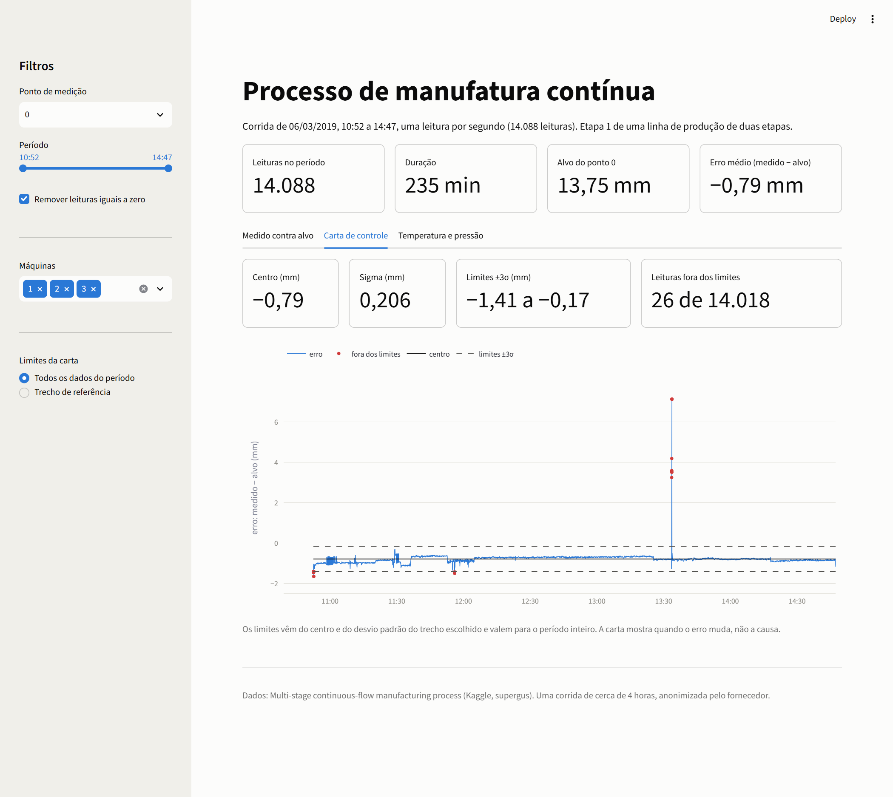
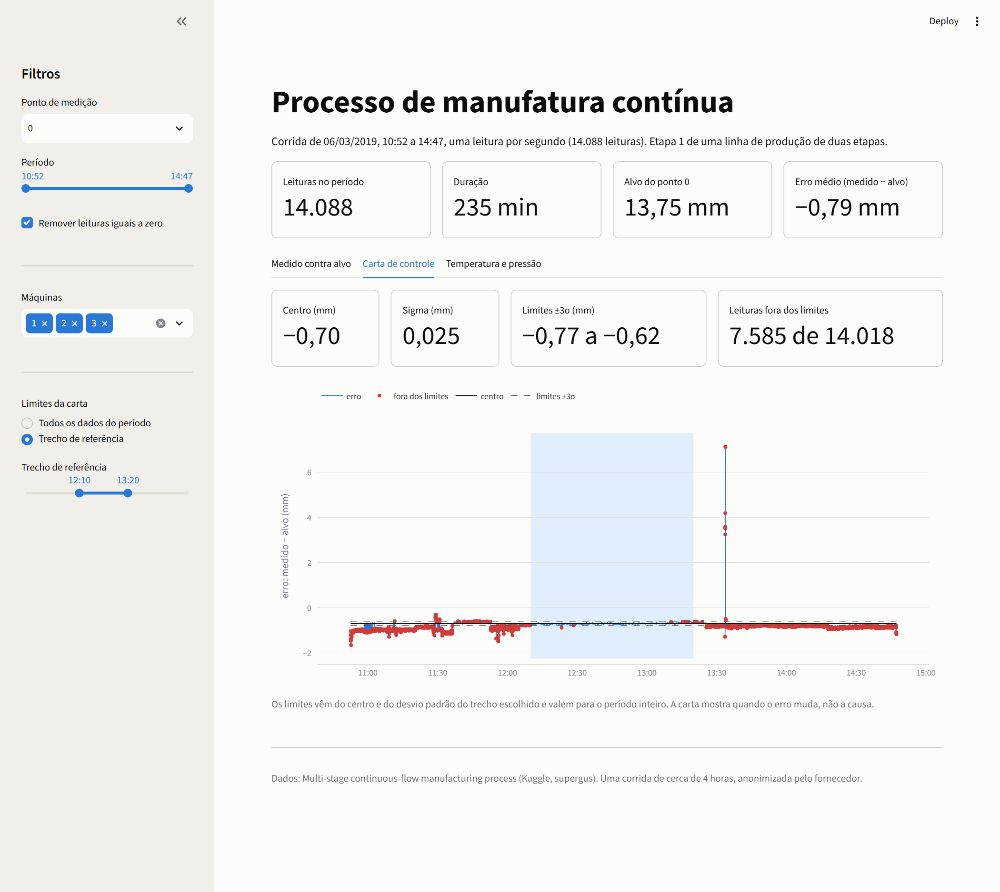
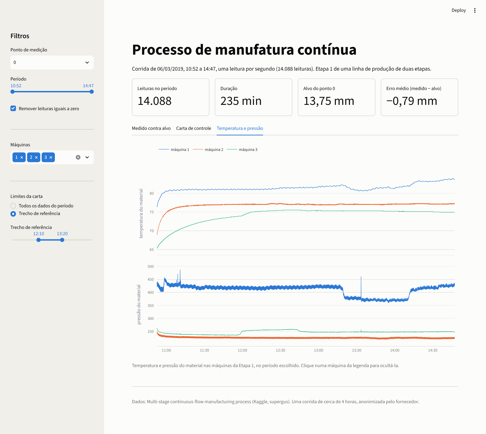

# P06. Dashboard de processo publicado

**Nº 6 de 37 na ordem de execução.** ID do projeto: P06.

**Cursos da Alura a fazer antes deste projeto (todos os que caem aqui na ordem das 4 carreiras):**
- CD/N1-12 - GitHub: publicar projetos de dados
- CD/N1-13 - Streamlit: dashboard interativo
- CD/N2-16 (= AD/N1-02) - Data Storytelling

O P05 publicado na web. Os gráficos da corrida de duas etapas viraram um app no Streamlit, com filtro por
ponto de medição, período e máquina, e com a carta de controle recalculada na hora a partir do trecho de
referência que a pessoa escolher. O app está em <https://p06-process-continuo.streamlit.app/>.

## Os dados

O mesmo dataset do P05, *Multi-stage continuous-flow manufacturing process* (Kaggle, `supergus`):
<https://www.kaggle.com/datasets/supergus/multistage-continuousflow-manufacturing-process>. É uma corrida de
cerca de 4 horas (10:52 às 14:47 de 06/03/2019), com uma leitura por segundo, 14.088 linhas. Repeti o
dataset de propósito: o trabalho aqui é transformar notebook em aplicação, e isso fica mais claro com um
processo que eu já conheço.

O CSV original tem 116 colunas e 8,5 MB e fica fora do repositório. O `preparar_dados.py` guarda em
`data/processo_app.csv` (3 MB, 37 colunas) só o que o app usa: o tempo, os 15 pontos de medição da Etapa 1
(valor medido e alvo) e a pressão e a temperatura do material das máquinas 1, 2 e 3. Esse recorte vai no
Git porque o servidor do Streamlit só enxerga o que está no repositório.

## O app

O Streamlit reexecuta o `app.py` inteiro a cada clique num filtro, então a leitura do CSV fica numa função
com `@st.cache_data` e roda uma vez só. Os gráficos são do Plotly, com zoom, dica ao passar o mouse e
legenda clicável. Os números seguem o formato brasileiro, e as cores são as do P05, uma por máquina.

No ponto 0 da Etapa 1, o alvo é 13,75 mm e o erro médio (medido menos alvo) é de −0,79 mm, sem as leituras
iguais a zero. O pico de 13:33 estica o eixo do primeiro gráfico até 20 mm, mas o zoom resolve o que no P05
eu resolvi cortando o eixo.



Na carta de controle, o resultado depende de onde saem os limites, como no P05. Com o centro e o desvio
padrão de todos os dados do período, o sigma é de 0,206 mm, os limites vão de −1,41 a −0,17 mm e a carta
acusa 26 de 14.018 leituras: 11 no pico de 13:33, 9 na partida e 6 por volta de 11:56.



Com o trecho de referência de 12:10 às 13:20 (o mesmo do P05), o sigma cai para 0,025 mm, os limites vão de
−0,77 a −0,62 mm e 7.585 leituras (54,1%) ficam fora, com as mudanças de nível aparecendo. A diferença é
que agora o trecho é um controle deslizante: dá para mover as pontas e ver os números e os pontos
vermelhos mudarem, o que mostra o quanto o resultado depende dessa escolha.



A terceira aba traz temperatura e pressão do material, com filtro por máquina. As três esquentam no começo e
a máquina 3 só estabiliza perto de 12:10. A pressão da máquina 1 cai por volta de 13:19 e volta a subir
por volta de 14:12, e a da máquina 3 dá um degrau para cima perto de 12:00. São os mesmos horários das
mudanças de nível do erro, o que continua sendo uma hipótese, não uma causa provada.



## Resultado

O P05 virou uma ferramenta que outra pessoa abre pelo link e usa sem ler o notebook: escolhe o ponto, o
período e as máquinas, e a carta de controle se recalcula. O resultado da análise é o mesmo do P05, o
processo fora do alvo e trabalhando em patamares que mudam em horários específicos. O que o app acrescenta
é deixar à vista que a leitura da carta muda com o trecho de referência.

## Limitações

O trecho de referência padrão (12:10 às 13:20) é o que escolhi a olho no P05, e os limites são calculados e
avaliados nos mesmos dados, sem uma segunda corrida para validar. O "54% fora" vale para essa escolha.

O seletor oferece os 15 pontos da Etapa 1, inclusive os que têm zeros demais (o ponto 5 tem 95%), e a caixa
remove só as leituras exatamente iguais a zero. No ponto 14 aparecem leituras abaixo de zero que ela não
remove, e não investiguei de onde vêm. A análise do P05 usou só os 8 pontos com menos de 10% de zeros.

O filtro por estágio que o plano previa não existe, porque o recorte tem só a Etapa 1. É uma corrida só,
de 4 horas, e a coincidência entre degraus de pressão e mudanças de nível do erro segue sem teste.

## Como rodar

```bash
pip install -r requirements.txt
python -m streamlit run app.py
```

O `data/processo_app.csv` já está no repositório. Para refazê-lo, baixe o CSV do Kaggle (link acima), salve
como `data/continuous_factory_process.csv` e rode `python preparar_dados.py`.

O próximo projeto do portfólio muda de assunto: um coletor de dados abertos brasileiros (ONS, INMET e ANP)
com a biblioteca Requests, tratando paginação e erro de rede.
